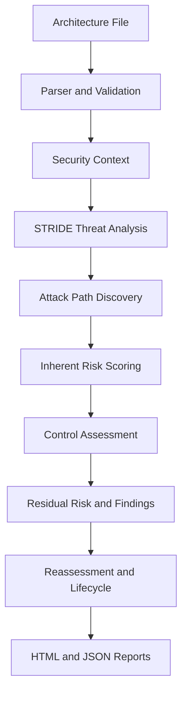

# ThreatModel AI

### Architecture-Driven Threat Modeling & Continuous Security Assessment

ThreatModel AI is a full-stack security engineering platform that converts architecture definitions into explainable threat models, attack paths, control assessments, remediation findings, reassessment comparisons, and exportable security reports.

The platform accepts YAML, YML, or JSON architecture files and updates every analysis page from the uploaded project. Risk decisions are produced by a deterministic, testable analysis engine rather than an external LLM.

> ThreatModel AI models plausible architecture-level security scenarios. It does not claim confirmed exploitability or validated production control effectiveness.

---

## What It Does

- Parses components, data flows, trust zones, exposure, criticality, and data classification.
- Generates contextual STRIDE threats across the supplied architecture.
- Discovers attack paths from exposed entry points to critical or sensitive assets.
- Calculates inherent threat risk and architecture path risk on a 5×5 model.
- Evaluates implemented, partial, and missing security controls.
- Estimates residual risk from declared control status and effectiveness.
- Creates stable remediation findings with owners, priorities, SLAs, and due dates.
- Reconciles findings across assessments as new, still open, resolved, or reopened.
- Produces machine-readable JSON and portable HTML assessment reports.

---

## Platform Workflow



---

## Application Pages

| Page | Purpose |
|---|---|
| Dashboard | Executive posture, key metrics, highest-risk path, risk matrix, and recent findings |
| Architecture Intelligence | Interactive system graph, trust zones, sensitive assets, flows, and component inventory |
| Threat Intelligence | STRIDE distribution, 5×5 matrix, priorities, threat ranking, filters, and threat register |
| Attack Path Analysis | Entry-to-asset paths, risk drivers, boundary crossings, node context, and residual exposure |
| Control Assessment | Required controls, declared implementation, effectiveness, coverage, and path relevance |
| Security Findings | Prioritized remediation queue, ownership, SLA, due date, and remediation guidance |
| Reassessment Center | Baseline/remediated comparison and finding lifecycle reconciliation |
| Assessment Reports | Current metrics, evidence navigation, JSON export, and portable HTML reporting |

---

## Architecture Model

An assessment file describes the architecture rather than a pre-generated list of findings.

```yaml
name: Example Commerce Platform

components:
  - id: api-gateway
    name: Public API Gateway
    type: gateway
    trust_zone: dmz
    internet_exposed: true
    criticality: critical
    data_classification: confidential

  - id: customer-db
    name: Customer Database
    type: database
    trust_zone: restricted_data
    stores_sensitive_data: true
    criticality: critical
    data_classification: restricted

data_flows:
  - id: flow-001
    source: api-gateway
    destination: customer-db
    protocol: TLS
    encrypted: true
    authentication: true
    sensitive_data: true
    authorization_required: true

existing_controls:
  - id: TM-C003
    name: Integrity Protection
    status: implemented
    effectiveness: high
    component_id: api-gateway
```

Supported control states include `implemented`, `partial`, and `missing`. Trust-zone names are project-defined, allowing trusted, untrusted, restricted, external, management, application, and other architecture-specific zones.

---

## Risk and Findings Model

ThreatModel AI separates three related measurements:

| Measurement | Meaning |
|---|---|
| Inherent Threat Risk | Likelihood × impact for an individual STRIDE threat |
| Inherent Path Risk | Architecture-level exposure before accounting for declared controls |
| Residual Path Risk | Estimated exposure after declared control status and effectiveness |

Finding priority is assigned independently for each control gap using its affected asset, path exposure, control context, and risk. A finding generated during an assessment starts open; lifecycle states appear when a baseline is compared with a later assessment.

---

## Technology Stack

### Analysis Engine and API

- Python
- FastAPI
- Pydantic
- PyYAML
- Uvicorn
- SQLite assessment persistence
- Pytest

### Web Application

- React 19
- Vite
- React Router
- React Flow
- Dagre automatic graph layout
- Lucide React
- Oxlint

---

## Project Structure

```text
threatmodel-ai/
├── api/                    # FastAPI application and assessment endpoints
├── core/                   # Deterministic security analysis engine
│   ├── attack_paths.py
│   ├── attack_path_risk.py
│   ├── boundaries.py
│   ├── control_assessment.py
│   ├── finding_reconciliation.py
│   ├── findings.py
│   ├── parser.py
│   ├── reassessment.py
│   ├── reporting.py
│   ├── risk.py
│   ├── service.py
│   └── threats.py
├── data/                   # Synthetic example architectures
├── frontend/               # React/Vite web application
├── reports/                # Generated assessment evidence
├── rules/                  # Security-control definitions
├── tests/                  # Engine and workflow tests
├── requirements.txt
└── README.md
```

---

## Run Locally

### Prerequisites

- Python 3.11+
- Node.js 20+
- npm

### 1. Clone and prepare the backend

```bash
git clone https://github.com/YOUR-USERNAME/threatmodel-ai.git
cd threatmodel-ai

python3 -m venv .venv
source .venv/bin/activate
pip install -r requirements.txt
```

### 2. Start the FastAPI service

```bash
uvicorn api.main:app --reload --host 127.0.0.1 --port 8000
```

Verify the service:

```bash
curl http://127.0.0.1:8000/api/health
```

Interactive API documentation is available at:

```text
http://127.0.0.1:8000/docs
```

### 3. Start the React application

Open a second terminal:

```bash
cd threatmodel-ai/frontend
npm install
npm run dev
```

Open:

```text
http://127.0.0.1:5173
```

---

## Validation

Run the Python test suite:

```bash
cd threatmodel-ai
source .venv/bin/activate
pytest -q
```

Validate the frontend:

```bash
cd threatmodel-ai/frontend
npm run lint
npm run build
```

---

## Reassessment Workflow

1. Upload a baseline architecture and run the assessment.
2. Review threats, attack paths, control gaps, and open findings.
3. Update the architecture file with remediated flows or controls.
4. Upload the remediated version in the Reassessment Center.
5. Compare coverage, residual risk, and finding lifecycle changes.
6. Export the updated evidence as HTML or JSON.

Stable finding fingerprints allow equivalent gaps to be reconciled between assessments instead of being recreated as unrelated records.

---

## Security and Data Statement

- Included example architectures are synthetic and contain no employer or customer infrastructure data.
- Uploaded architecture data is used for the active assessment workflow.
- Scores are deterministic estimates derived from declared architecture and control state.
- Attack paths are plausible security scenarios, not proof of compromise.
- Production use requires independent validation, authentication, authorization, secure storage, deployment hardening, and organizational risk calibration.

---

## Current Status

ThreatModel AI V2 currently includes the end-to-end assessment workflow, dynamic project uploads, interactive architecture visualization, STRIDE analysis, attack-path scoring, control assessment, finding management, reassessment, persistence, and report export.

Planned production-hardening work includes authenticated workspaces, organization-specific rule packs, deployment configuration, audit logging, and CI/CD security automation.

---

## Author

**Amr Abdelaziz**  
Cybersecurity Engineer — Security Architecture, Security Products, Vulnerability Management, and DevSecOps

[LinkedIn](https://www.linkedin.com/in/amr-ahmed-abdelaziz94) · [GitHub](https://github.com/AmrAbd-Elaziz)

